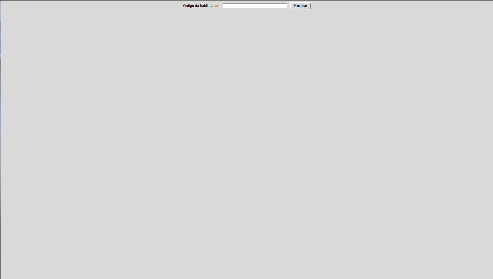
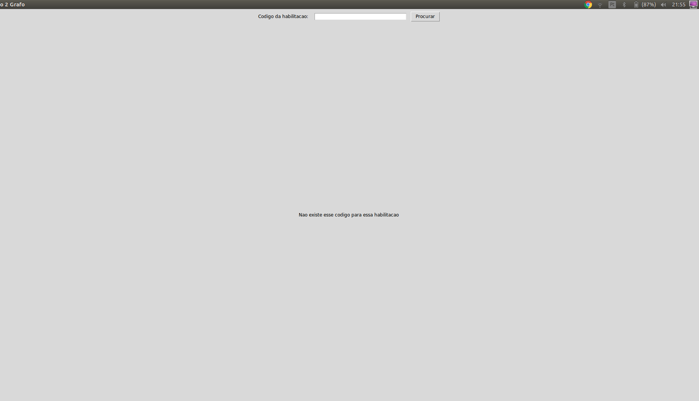
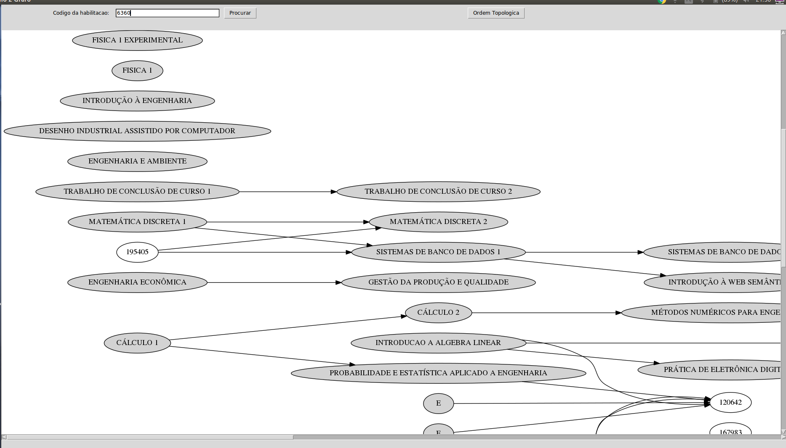
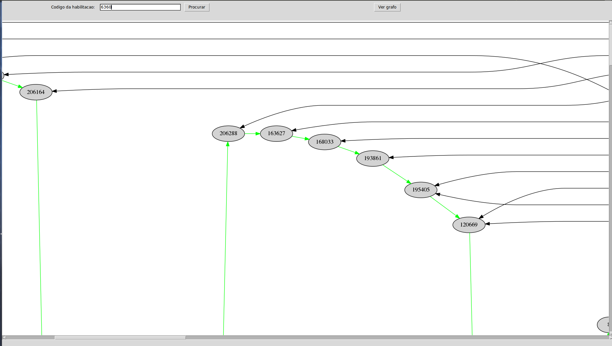

# Trabalho de Grafos 2

## Alunos
* Nome: Guilherme Guy - Matrícula: 16/0123186
* Nome: Joberth Rogers - Matrícula: 16/0128013

## Instalando dependências

As dependências usadas no projeto são:
* Tkinter
* Python 2
* mongo
* E outros descritos em requirements.py

Para instalar algumas essas depêndencias do projeto em um sistema Ubuntu rode no terminal o comando:
    
    sudo apt-get install python-tk
    pip install -r requirements.txt

Além disso é preciso instalar o Mongo. Uma maneira fácil de se fazer isso é pela imagem Docker dele, um exemplo:
    
    docker run --name "mongodb" -d -p 27017:27017 p28017:28017 -e AUTH=no mongo docker start mongodb

## Obtendo base de dados

Este projeto necessita dos dados de matérias da UnB. Para obter estes dados é preciso utilziar [webscraper do Matrícula Web MWScanner]([https://link](https://github.com/ads-unigrade-2019-1/MWScanner)).

Os dados devem ser salvos no banco "mwscanner" em sua instalação do mongo.

## Rodando o projeto

Para executar o projeto use o comando (obsercação: utilizar python2):
    
    python src/Interface.py

Isto irá abrir uma interface de usuário, nela é possível carregar uma Habilitação que existe na UnB por meio de uma caixa de texto. Este processo pode demorar um pouco.

Após a carregar é exibido um grafo com as disciplinas que estão cadastradas nesta Habilitação**

## Funcionalidades

Após rodar o comando acima, você será redirecionado para essa tela principal onde terá um campo para preencher:

Esse campo corresponde o código da habilitação da matéria encontrada no matrícula web, caso esse código seja incompatível e não exista, vc receberá uma mensagem de não correspondência:

Caso exista, você irá ver todas as matérias e seu fluxo, correspondente a habilitação:

Há a opção de verificar a ordenação topológica das matérias apertando no botão da parte inferior

### Isso é tudo pessoal!!!